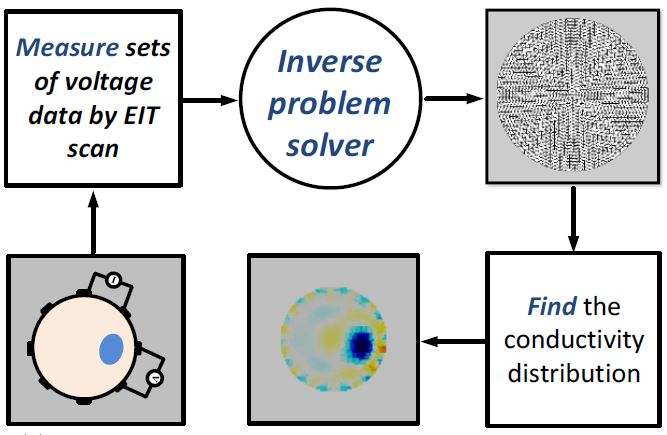
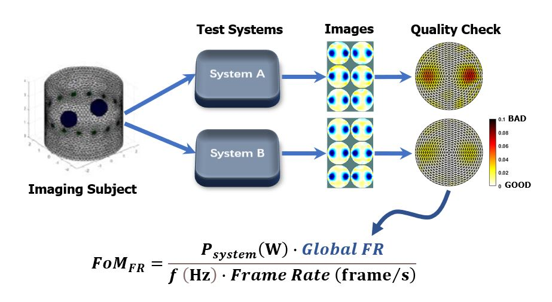

# EIT_FRFoM: An Imaged Based EIT Figure-of-Merit
The project provides a simple and reproducible methodology for the universal evaluation of the performance of electrical impedance tomography (EIT) systems using reconstructed images.

## Background
EIT is an impedance measurement technique that uses the tomography principle to reconstruct an image that illustrates the inner impedance distribution of the subject under test (SUT), it's basic working principle is as shown below:

## Universal Figure-of-Merit (FoM) for EIT system evaluation
Based on objective full referencing (FR), this evaluation method provides a visually distinguishable hot colormap and quantitative image quality metrics. 

Using the FR metric, a imaged based EIT FoM is proposed:

__Psystem__ is the system power consumption

__*f*__ is the system EIT operating frequency

__Global FR__ is the quantitative image quality metric

__Frame Rate__ is the system image frame per second

The new FoM addresses the issues where common electrical parameters used in EIT hardware evaluation are not directly related to the quality of EIT images.

## Methodology
Ensuring a fair evaluation and comparison of EIT system performance requires:
* Using identical SUT can produce a reference image (ground truth) while capable of being measured by hardware;
* Using identical reconstruction software (inverse problem solver);
* Using identical FoM factor for evaluation.

As an imaging system, the comparison should be ultimately demonstrated in terms of an image quality factor, and to be widely adopted, the method should be simple and reproducible.
### 1. Identical SUT
For hardware system evaluation, a resistive phantom is used and is shown below: 

By skipping electrodes, this phantom can be used for 8, 16, or 32 electrode systems. 16 electrode EIT system was chosen as an illustrative example here. 

The 16 electrode ideal dataset for the reference image (ground truth) was generated through simulation using the resistive phantom with __adjacent EIT scan__, the two __X resistive elements__ was toggled between 68.1 Ω and 0 Ω for homogeneous and inhomogeneous datasets for EIT differential imaging. 

The 16 electrode ground truth image datasets are provided in __sample_data.mat__ (in codeFiles folder) as __ref__ (inhomogeneous) and __data__(homogeneous).

### 2. Identical reconstruction software
The reconstruction software runs on MATLAB and includes:

__eidors-v3.10-ng.zip__ and __2.FR_FOM_FORMAT.m__.

__sample_data.mat__ inlucdes __REF_Data__ (example of measured inhomogeneous datasets) and __EIT_Data_store__ (example of 50 frames of measured homogeneous datasets) and __ref__ (inhomogeneous) and __data__(homogeneous) obtained through resistive phantom simulation as the ground truth for comparion.

### 3. Identical FoM factor
Run the __FR_FOM_FORMAT.m__ file will generate the FRx replot and the __Global FR__ and __ROI FR__ of the test EIT system. The __Global FR__ can be used to compute the new image-based EIT FoM shown before.

Please refer to the paper below for more details:
*“An Imaged-Based Method for Universal Performance Evaluation of Electrical Impedance Tomography Systems,” in IEEE Transactions on Biomedical Circuits and Systems, 2021*

